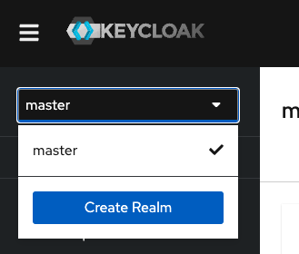
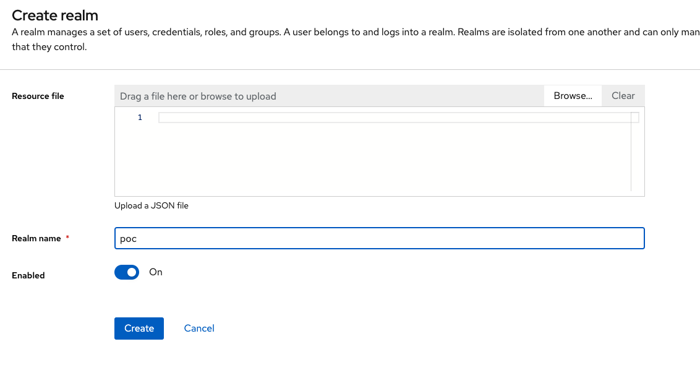
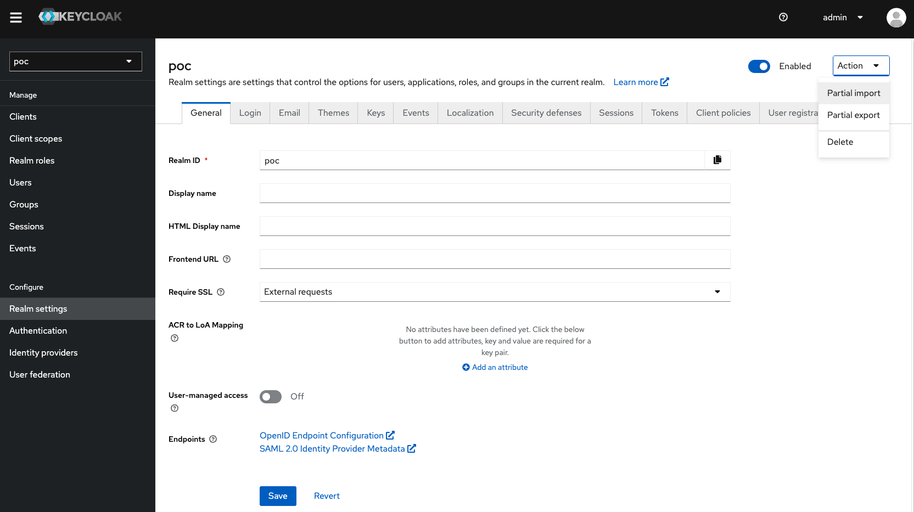
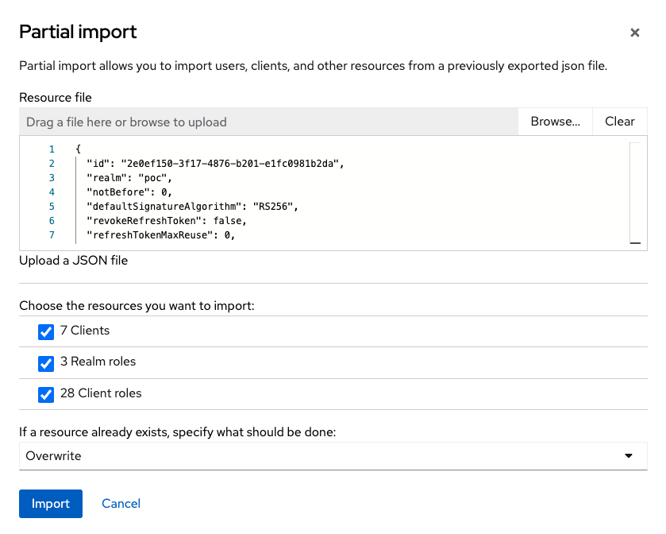
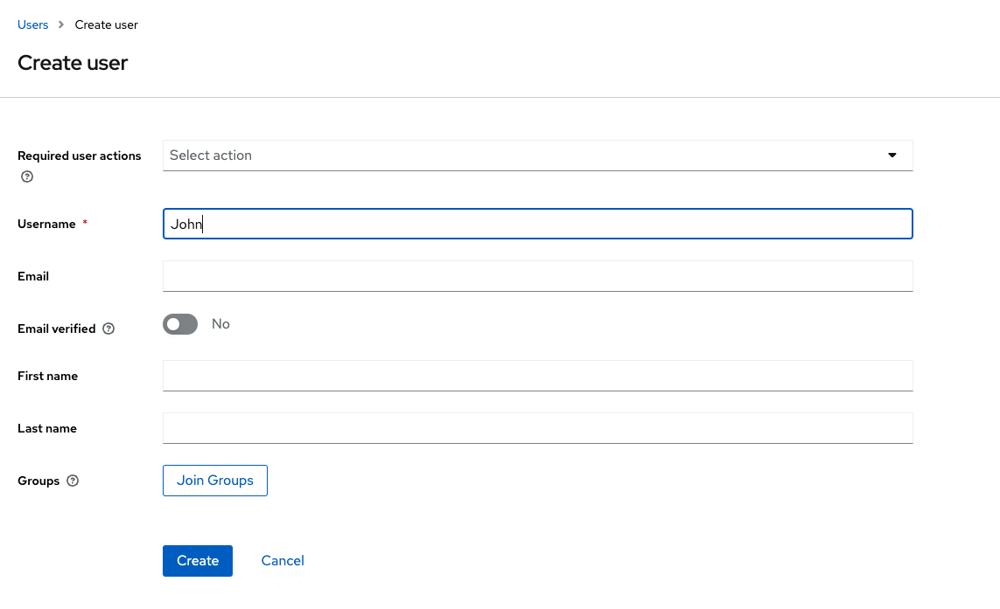
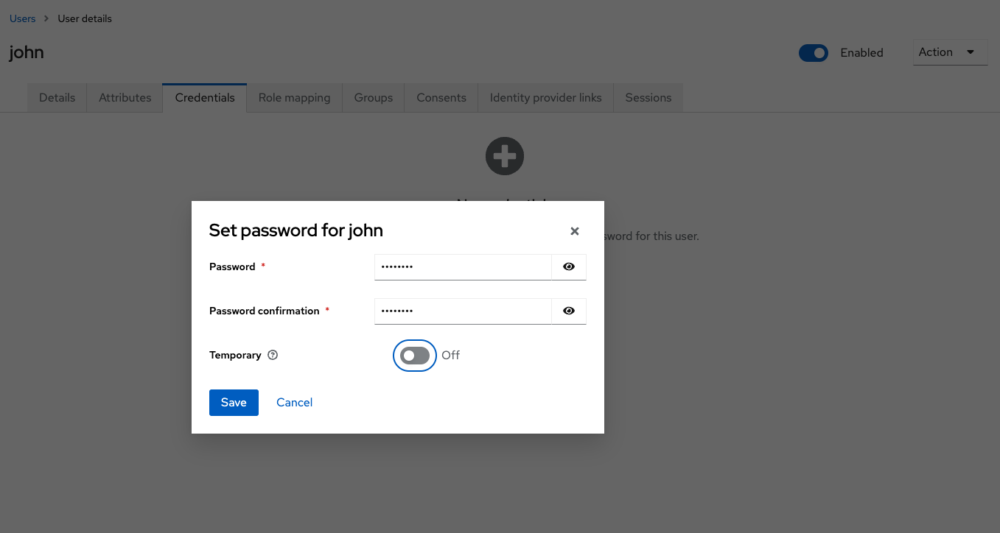
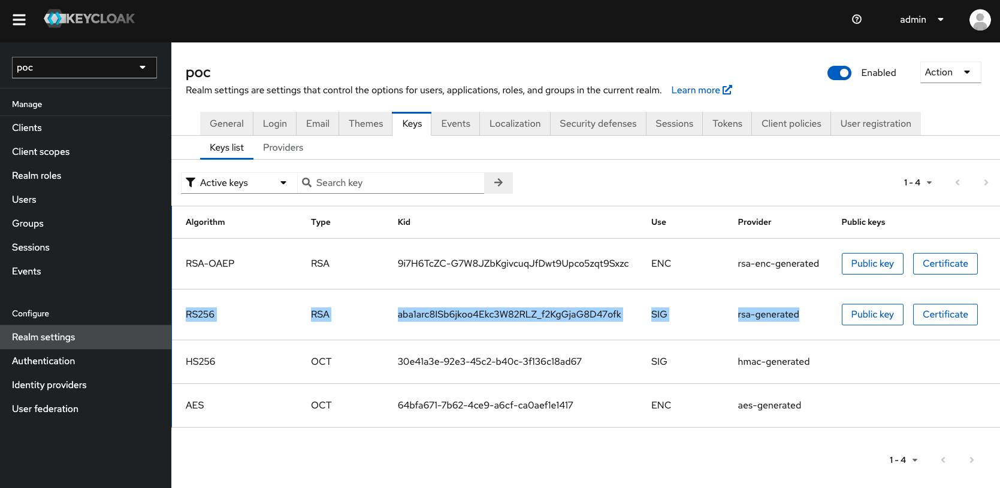
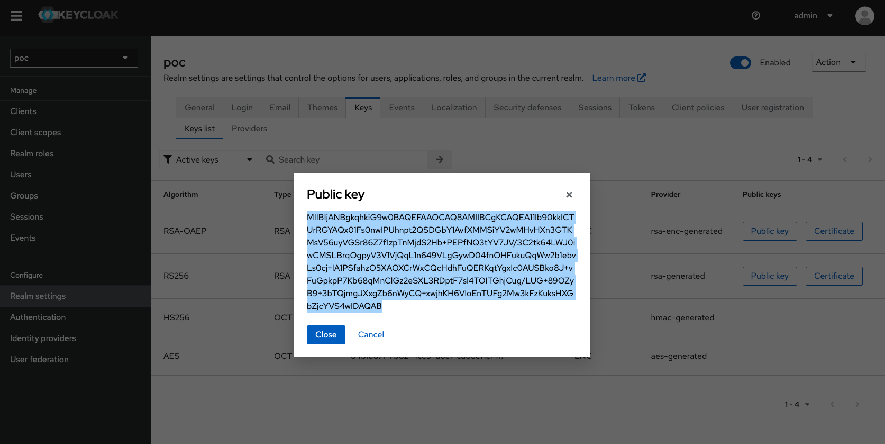
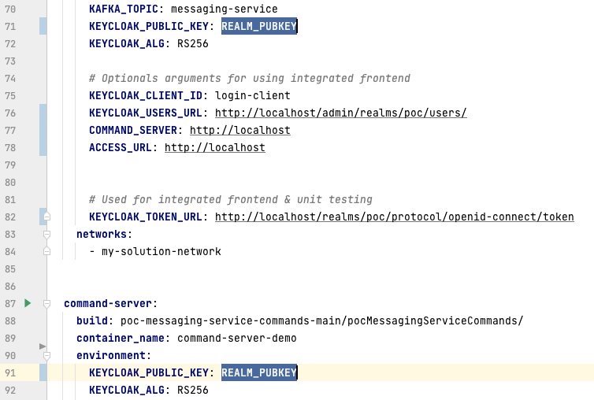
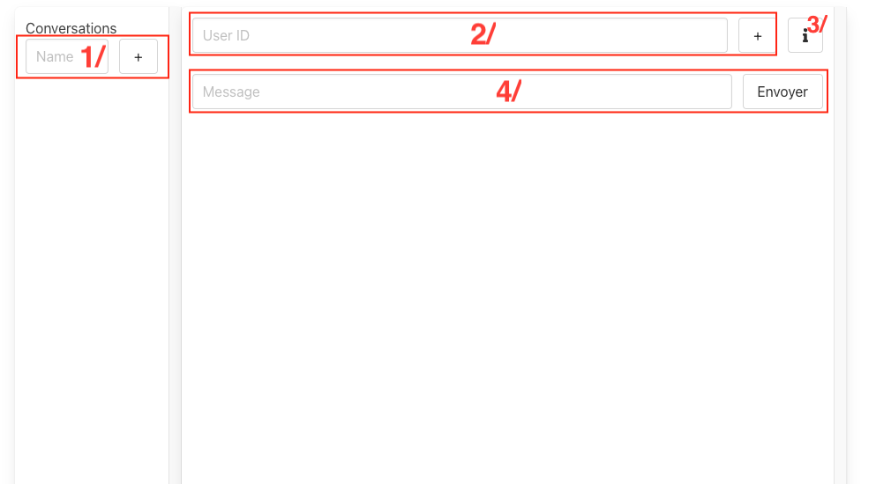

# poc-messaging-service-demo

This project combines both sides of the messaging service POC (commands and queries), in a working docker-compose.yml file.
This file also provides all necessary services and a Nginx reverse proxy if the role of an API Gateway.

## Installation
> [!NOTE]
> Depending of your OS and how you configured it, docker might require that you run the commands as root. So, if
> a docker command raise a permission error you should probably run it with sudo. 

### Requirements
- Having docker installed
- Nothing listening on ports :
  - 80
  - 8080
- 2GB disk space

Start to download the project on your computer, and change your working directory to the project folder.
It can be achieved using these commands if you have github installed:
```shell
~$ git clone https://github.com/BastienLBCH/poc-messaging-service-demo.git
~$ cd poc-messaging-service-demo/ 
```
(don't copy the ~$ it's just there to show that the command starts)

To deploy the project, first start all the services using : 
```bash
docker compose up -d
```
Next step is to create our users on keycloak, then obtain the realm's public key which will be required to authentify requests.


### Configure Keycloak
#### Realm Creation
Open your browser to [http://localhost:8080](http://localhost:8080). As it is the first startup keycloak might take a bit
of time to be available, so don't panic and keep refreshing the webpage.

When you manage to get access to keycloak, click on "Administration Console" then enter the completely secure admin credentials :
- username : admin
- password : admin

Once you are logged in, on the top left corner click on "master" then on the blue button "Create Realm"


Name it "poc" then click on create


Now that your realm is created, on the left menu, find the "Realm Settings" tab, click on it then, on the top right 
corner click on "Action", then "Partial import" and select the file "realm-export.json" in this project's "keycloak" folder




On the newly opened window select to import all the resources and chose the "Overwrite" option if a resource already exists
then click on "Import" then "Close"



#### Creating users
Now that your realm is created it is time to create your users.
Go to the users tab on the left menu, find the blue button "Add user". Fill the form the way you want, the only required field is
the username, you can leave anything else blank then click on create.


Now that your user is created, go to the "Credentials" tab and click on "Set password"
Set the "Temporary" option to off then click on "save" and click again on "Save password"


Your user is now created and configured, you can repeat these operations for as many users as you want.


#### Obtaining realm rsa key

Last step is to obtain the generated rsa key. Go back to "Realm settings" then find the "Keys" tab.
Find the RSA generated key using the RS256 algorithm :


Click on "Public key" on the right, then copy the key showing on screen:


Once you have this key, open the docker-compose.yml file in a text editor and, on lines 71 and 91, replace "REALM_PUBKEY" by the key you just
copied:



### Completing installation
Now the installation is complete, all you need is to restart your services using this command :
```shell
docker compose stop && docker compose up -d
```

You'll be able to access the demo interface at this address :
[http://localhost](http://localhost)


> [!IMPORTANT]
> This service is currently only available on your machine. To open it to other devices on your network, go back to the dockerfile and,
> for the query server, find the options :
>  - KEYCLOAK_USERS_URL
>  - COMMAND_SERVER
>  - ACCESS_URL
> 
> on lines 76, 77, 78 and replace "localhost" by your computer ip address. Once done restart the service with the command given above

> [!NOTE]
> Kafka can be slow to start, so when you will create your first conversation it can take a bit of time to first appear.


## Usage
### Demo frontend

> [!NOTE]
> As a reminder, this frontend is developed for easier testing, as ***demo*** purpose. 
> Please take note that I am not a frontend developer, never pretented to be one 
> and that on a "real" situation I would have developped it in another service with an improved UI.

Access to [http://localhost](http://localhost)
Write the credentials of a user you created then click on login or press enter.

You should see this interface, let's take a quick tour :


1. **Conversation creation form** : Write a conversation name then click on the "+" button or press enter to create a conversation
2. **Adding a user to a conversation**: Once your conversation is created, select it then write the userid of a user to add
it to the conversation.
3. **Information button** : Clicking on it will list the created users you can add to a conversation. UI being bad, the button to get back to this screen is on the top left.
4. **Message form** : Place to write your message. To send it click on "Send" or press enter. Make sure you selected a conversation before sending a message.

Before sending a message or adding a user to a conversation, please make sure to select the conversation before. 

### API

Base URL: http://localhost

#### Create a conversation
- **Endpoint**: /conversations/
- **Method**: POST

Headers :

| Attribute       |                  Value |
|:----------------|-----------------------:|
| Authorization   |  Bearer {access token} |


Body :
(Can either be raw using the JSON syntax or a form)

| Attribute |               Value |
|:----------|--------------------:|
| name      | {conversation name} |
---

#### Delete a conversation
- **Endpoint**: /conversations/{conversation id}/delete
- **Method**: DELETE

Headers :

| Attribute       |                  Value |
|:----------------|-----------------------:|
| Authorization   |  Bearer {access token} |
---


#### Add user to a conversation
- **Endpoint**: /conversations/{conversation id}/members
- **Method**: POST

Headers :

| Attribute       |                  Value |
|:----------------|-----------------------:|
| Authorization   |  Bearer {access token} |


Body :
(Can either be raw using the JSON syntax or a form)

| Attribute       |                                                 Value |
|:----------------|------------------------------------------------------:|
| participant_id  |           {Id of the user to add to the conversation} |
---

#### Remove user from a conversation
- **Endpoint**: /conversations/{conversation id}/members/{user id}/remove
- **Method**: POST

Headers :

| Attribute       |                  Value |
|:----------------|-----------------------:|
| Authorization   |  Bearer {access token} |

---

#### Send a message to a conversation
- **Endpoint**: /conversations/{conversation id}
- **Method**: POST

Headers :

| Attribute       |                  Value |
|:----------------|-----------------------:|
| Authorization   |  Bearer {access token} |


Body :
(Can either be raw using the JSON syntax or a form)

| Attribute        |                                                 Value |
|:-----------------|------------------------------------------------------:|
| message_content  |                 {Message to send to the conversation} |

---

#### List all user's conversation
- **Endpoint**: /conversations
- **Method**: GET

Headers :

| Attribute       |                  Value |
|:----------------|-----------------------:|
| Authorization   |  Bearer {access token} |

---

#### Get all messages from a conversation
- **Endpoint**: /conversations/{conversation_id}
- **Method**: GET

Headers :

| Attribute       |                  Value |
|:----------------|-----------------------:|
| Authorization   |  Bearer {access token} |

---


#### Get all members from a conversation
- **Endpoint**: /conversations/{conversation id}/members
- **Method**: GET

Headers :

| Attribute       |                  Value |
|:----------------|-----------------------:|
| Authorization   |  Bearer {access token} |

---


### Connect the websocket
The service uses websockets to send events in real time to the frontend, so it can update without reloading everything.

- **endpoint**: ws://{base url}/ws/{token}

The token in the url is the Json Web Token provided on login